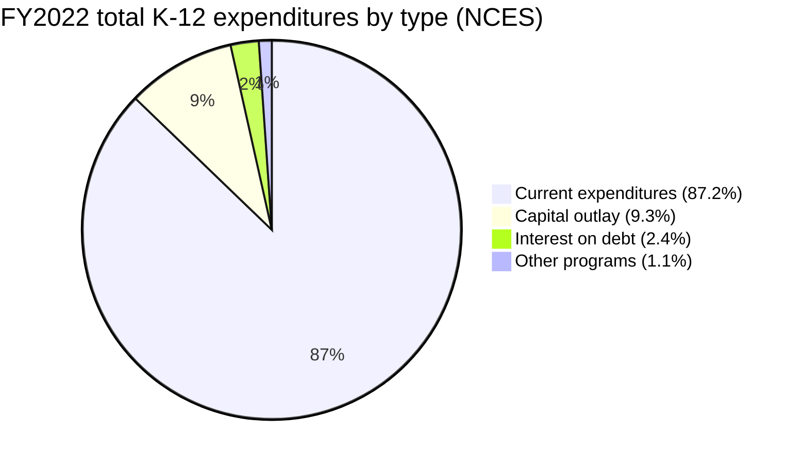
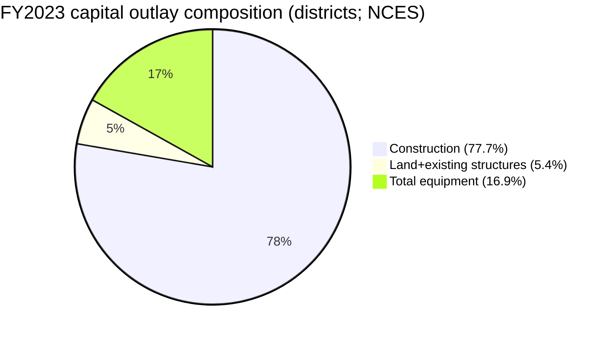
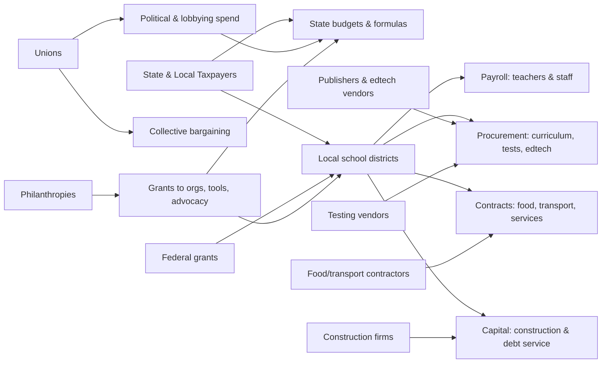

# Who Profits from the U.S. Educational‑Industrial Complex

## Executive Summary

The United States’ compulsory, publicly funded K–12 system is a very large **publicly financed market**. In fiscal year 2022, total revenue collected for public elementary and secondary education across the 50 states plus DC was about **$909.2B**, with **86.3% from state and local governments** and **13.7% from the federal government**, according to the entity["organization","National Center for Education Statistics","u.s. education stats agency"]. citeturn23view0 This recurring, tax-financed spending creates dependable revenue streams for (a) public‑sector labor and pension systems; (b) private vendors competing for procurement contracts; and (c) a surrounding policy‑influence ecosystem (lobbyists, consultants, advocacy organizations, and philanthropies) that can shape rules, standards, and funding flows. citeturn23view0turn22search11turn20search0

“Profit” in this report is treated narrowly as **documentable financial gain** (net income, margins, contract revenue) and more broadly as **institutional revenue capture** (budget share, fee income, dues flows), without assuming motives beyond evidence. Compulsory schooling is addressed as a legal and administrative structure—by 1918, all states had compulsory attendance laws—whose existence helps keep demand for schooling services (and supporting products) stable over time. citeturn22search11turn22search1turn22search31turn22search21

Three money flows dominate the educational‑industrial complex:

First, the largest share of K–12 spending is on **people**. In FY2022, **current expenditures** were **$767.8B** (87.2% of total K–12 expenditures), and instruction plus instructional staff support services together comprised **$497.1B (64.7%)** of total current expenditures. citeturn23view0 The main “beneficiaries” here are teachers and other school employees through wages and benefits (not corporate profit), and systems that manage payroll, health benefits, and retirement obligations. citeturn23view0

Second, the system sustains large **vendor markets** in assessments/testing, instructional materials/curriculum, edtech licensing and devices, transportation, food services, and school construction/debt. For example, in FY2023, school districts’ **capital outlay** was **$99.1B**, of which **construction** alone was **$77.0B (77.7%)**. citeturn24view0 In school nutrition, the federal **National School Lunch Program** provided **>4.8B lunches at a total cost of $17.7B** in FY2024, and the **School Breakfast Program** provided **>2.5B breakfasts at a total cost of $5.7B**. citeturn25search0turn25search4 Connectivity subsidies also expand markets: the entity["organization","Federal Communications Commission","u.s. telecom regulator"] describes E‑Rate demand funding up to an inflation‑adjusted annual cap (e.g., $5.058B for funding year 2025). citeturn27search4turn27search24turn27search16

Third, **political and standards regimes** can expand or stabilize these markets. The federal No Child Left Behind framework required statewide accountability systems and **annual testing for students in grades 3–8** aligned to state standards, increasing the importance (and thus procurement volume) of standardized assessments and related reporting infrastructure. citeturn22search5turn22search12turn22search19 While the later Every Student Succeeds Act (ESSA) replaced NCLB and increased state flexibility, it still defines federal expectations for transparency and state plans. citeturn22search3turn22search16turn22search9

On union financing and political spending, public documents show large internal budgets and notable political/lobbying allocations. For the entity["organization","National Education Association","teachers union us"] (fiscal year ending 08/31/2024), the LM‑2 filing shows **$419.94M total receipts** and **$39.15M** categorized as “Political Activities and Lobbying,” plus **$127.97M** in “Contributions, Gifts, and Grants” (LM‑2 category definitions). citeturn11search2turn16search0turn15search0 For the entity["organization","American Federation of Teachers","teachers union us"] (fiscal year ending 12/31/2024), an LM‑2 filing shows **$49.67M total receipts** and **$1.06M** categorized as “Political Activities and Lobbying.” citeturn19search0 These LM‑2 categories are not identical to federal lobbying disclosure totals; nevertheless, they are primary, standardized disclosures of union spending categories. citeturn6search20turn19search0

Case studies illustrate how these mechanisms operate in practice: a Texas statewide assessment contract valued at **$340M over four years** shifting from Pearson to ETS; citeturn26search2turn26search22 the Los Angeles iPad initiative (Apple devices plus Pearson curriculum) involving a **$500M** contract and additional infrastructure funding via bonds; citeturn26search9turn26search13 and the charter/CMO ecosystem where public per‑pupil revenue can be complemented by philanthropy and internal licensing fees, such as KIPP trademark license fees based on per‑pupil operating revenue. citeturn26search12turn26search8turn26search20

## Methodology and data sources

This report focuses on the United States because the user did not specify a narrower geography. “Schools” refers primarily to **public K–12** and publicly funded charter schools, with limited coverage of testing and pathways that extend into postsecondary admissions (College Board, ACT) because these are tightly coupled to compulsory schooling completion and public secondary education operations. citeturn23view0turn28search0turn29search2

The core quantitative backbone comes from: (1) national and district finance data from NCES’s NPEFS/CCD and the Census/NCES F‑33 school district finance system; citeturn23view0turn24view0 (2) union finances from the U.S. Department of Labor OLMS LM‑2 disclosures and the Federal Register discussion of LM‑2 coverage and purpose; citeturn11search2turn16search0turn19search0turn6search20 (3) nonprofit finances from IRS Form 990 records (via ProPublica’s Nonprofit Explorer and, where available, IRS PDFs); citeturn21search3turn28search0turn28search5turn21search7turn28search4 (4) federal program cost and cap information for school meals and E‑Rate from USDA ERS and FCC documentation; citeturn25search0turn25search4turn27search4turn27search24 and (5) policy baseline sources (U.S. Department of Education summaries and related legal references) for federal accountability/testing foundations. citeturn22search5turn22search3turn22search12

Lobbying and campaign finance **methods** are documented through primary federal disclosure systems (LDA.gov for lobbying filings and FEC for campaign finance), as well as state‑level regulators (example: New York’s ethics/lobbying commission). citeturn20search0turn20search7turn20search16 This report includes a “selected extract” dataset in the appendix where high‑confidence, directly sourced figures were available in the research session; it explicitly flags gaps where issue‑specific attribution is not possible or where the underlying portals were not practically accessible for comprehensive scraping in this format. citeturn20search0turn20search3turn20search16

Two analytic constraints are central. First, many entities in education are nonprofits or public agencies; “profit” is therefore often better conceptualized as **revenue capture** rather than shareholder net income. citeturn23view0turn21search3turn28search0 Second, lobbying and political activity data are dispersed and not always comparable: organizational “political and lobbying” spending categories, PAC spending, and LDA lobbying expenses can all differ in scope and definitions. citeturn19search0turn20search0turn6search20

## Stakeholders, revenue streams, and profit mechanisms

Compulsory education and publicly funded schooling create a persistent purchasing base—districts and state agencies—that repeatedly buy labor, services, facilities, and compliance infrastructure. The table below maps major stakeholder groups requested by the user to their principal revenue streams, typical mechanisms, and frequently observed influence channels (described factually, not ascribed to intent). The examples are intentionally concentrated on entities for which primary or near‑primary evidence was available in this research session.

| Stakeholder category | Primary revenue streams | Profit / revenue‑capture mechanisms | Examples of major entities (selected) | Common market‑expansion levers (documented categories) |
|---|---|---|---|---|
| School districts and state education agencies | Tax revenue allocations; federal program funds | Control large procurement budgets; issue bonds for facilities; set RFP specifications; recurring contract renewals; compliance spending | entity["organization","Los Angeles Unified School District","school district los angeles"] (case study), entity["organization","Texas Education Agency","state education agency texas"] | Procurement rules and RFP design; adoption cycles; compliance with federal testing transparency requirements citeturn26search9turn26search2turn22search5turn22search3 |
| Teachers and school employees | Salaries, benefits, pensions (public budgets) | Largest spending share in current expenditures; stable demand tied to enrollment/attendance | (Public workforce; not a single firm) | Collective bargaining; credentialing frameworks; workforce policy debates citeturn23view0 |
| Teachers’ unions | Member dues; investment income; affiliate fees; political spending vehicles (separate from core union accounts) | Dues‑financed operations; classified spending on political activities/lobbying and contributions; ballot and electoral spending via PACs/other structures | entity["organization","U.S. Department of Labor Office of Labor-Management Standards","union financial disclosure office"] (LM‑2 filings) | Lobbying and political advocacy; public communications; litigation support; mobilization (as reflected in spending categories and transactions) citeturn16search0turn19search0turn6search20 |
| Charter management organizations and networks | Per‑pupil public funding; philanthropy; federal charter grants; internal fees (where applicable) | Network services and centralized procurement; licensing and shared services fees; fundraising supplements per‑pupil revenue | entity["organization","KIPP Foundation","charter network us"]; entity["organization","National Alliance for Public Charter Schools","charter advocacy org us"] | Federal Charter Schools Program funding narratives; reporting requirements; parent‑facing enrollment communications; facilities financing support citeturn26search12turn26search32turn26search20turn30search20 |
| Textbook/curriculum publishers | Curriculum sales; digital subscriptions; professional development | State/district adoption cycles; bundled print+digital; alignment to standards; district‑wide licensing | entity["company","Savvas Learning Company","k-12 curriculum us"] (ex‑Pearson K‑12); entity["company","McGraw Hill","education publisher us"]; entity["company","Houghton Mifflin Harcourt","education publisher us"] | Standards alignment incentives; procurement bundling; digital platform lock‑in citeturn21search8turn21search1turn21search2 |
| Testing and assessment companies (nonprofit and for‑profit) | State assessment contracts; test development/scoring; admissions testing fees (postsecondary‑linked) | Large multi‑year contracts; recurring annual test cycles; data/reporting services | entity["organization","Educational Testing Service","nonprofit testing org"]; entity["organization","College Board","college admissions nonprofit"] | Testing mandates and accountability systems; reporting requirements; contract rebids and vendor consolidation citeturn26search2turn22search5turn28search0turn21search3 |
| Edtech platforms and device ecosystems | Software licensing; device sales; cloud services; paid add‑ons (including AI tools) | Enterprise contracts with districts; freemium → paid tier migration; integration as “core infrastructure” | entity["company","Google","technology company us"]; entity["company","Microsoft","technology company us"] | Licensing and pricing model changes; district procurement; dependency via identity/email/collaboration infrastructure citeturn27search2turn27search6turn27search3turn27search15 |
| Construction firms, architects, bond markets | Construction and renovation spending; debt issuance fees | Capital outlay contracts; long‑term debt servicing; facilities modernization and expansion | entity["company","Veritas Capital","private equity new york"] (publisher ownership example; illustrates PE structure in education supply chain) | Bond funding decisions; capital planning; compliance with facilities standards; project delivery systems citeturn24view0turn21search2turn26search9 |
| School transportation contractors | Routing and operations contracts | Multi‑year routing contracts; fleet replacement cycles; labor and fuel pass‑through clauses | entity["company","First Student","school bus operator us"]; entity["company","EQT Infrastructure","private equity investor eu"] | Contract renewals and consolidation; safety and compliance requirements; labor market constraints affecting pricing citeturn25search21turn25search25turn25news35 |
| Food services and suppliers | Federal meal reimbursements; district cafeteria operations contracts | Per‑meal reimbursement flows; managed service contracts; large‑scale procurement | entity["company","Aramark","food services company us"]; entity["company","Sodexo","food services company france"]; entity["company","Compass Group","food services company uk"]; entity["organization","U.S. Department of Agriculture","federal agriculture agency"] | Federal reimbursement rate setting; contract bidding; vendor performance monitoring citeturn25search0turn25search4turn25search20turn25search23 |
| Lobbyists, political consultants, and disclosure systems | Fees for advocacy services; compliance reporting services | Demand driven by complex education legislation and procurement budgets | entity["organization","U.S. Senate","federal legislature chamber"] (LDA portal) | LDA filings and contribution reporting; issue framing; coalition building citeturn20search0turn20search20turn20search3 |
| Think tanks and research/advocacy organizations | Grants and donations; contracts; publications | Policy influence through research framing and dissemination | (Illustrated via education philanthropy literature) | Research funding; policy convenings; model legislation and standards narratives citeturn30search6turn30search29turn30search10 |
| Philanthropies and “strategic giving” | Endowment returns; grantmaking budgets | Grantmaking to advocacy, tools, standards, schools, and facilities financing | entity["organization","Walton Family Foundation","philanthropy bentonville ar"]; entity["organization","Bill & Melinda Gates Foundation","philanthropy seattle"]; entity["organization","Chan Zuckerberg Initiative","philanthropy llc"] | Funding of standards/policy infrastructure; charter facilities capital; tool‑building and edtech grants citeturn30search1turn30search20turn30search6turn30search3 |

A key structural point: many of these stakeholder groups “profit” not because compulsory schooling is promoted in the abstract, but because **compulsory attendance plus public finance** yields a predictable purchaser for goods and services. The rise of modern attendance/truancy regimes is well documented: by 1918, all states had some form of compulsory attendance law, and contemporary attendance policy remains an active statutory and administrative domain. citeturn22search11turn22search1turn22search21turn22search30

## Money flows and market structure in U.S. K–12

Public education finance creates a layered market: **labor markets** (teachers and staff), **procurement markets** (goods/services), and **capital markets** (construction and debt). The finance statistics below come from NCES’s national totals for FY2022 and district‑level capital outlay for FY2023.

### Scale and composition of spending

In FY2022, total revenues collected for public K–12 were **$909.2B**, while total expenditures were **$880.7B**. citeturn23view0 Total expenditures break down into **87.2% current expenditures**, **9.3% capital outlay**, **2.4% interest on debt**, and **1.1% other programs**. citeturn23view0 This matters for “who profits” because it indicates where the largest addressable pools are: recurring staff costs (current expenditures) versus episodic but huge construction cycles (capital outlay). citeturn23view0turn24view0

Within current expenditures, instruction and instructional staff support services together account for **$497.1B (64.7%)**. citeturn23view0 This is the financial center of gravity of the system and explains why labor negotiations and staffing rules are among the most economically consequential policy areas. citeturn23view0

### Construction and facilities

Capital outlay is one of the clearest “industry” channels because it is directly monetized via private construction and professional services contracts. In FY2023, school districts’ **total capital outlay** was **$99.1B**, and **construction** accounted for **$77.0B (77.7%)**. citeturn24view0 This aligns with a long‑standing pattern: facility investment is often financed via local bonds, creating downstream interest payments and underwriting/legal services sectors (not fully quantified here due to data fragmentation across issuers). citeturn23view0turn26search9

A vivid illustration is the Los Angeles iPad initiative, where reporting indicates that the device purchase and supporting infrastructure were funded by **construction bonds**, even though bonds are typically intended for buildings and repairs. citeturn26search9 The mechanism matters analytically because it shows how capital financing streams can be repurposed to procure technology at scale—creating unusually large, rapid vendor revenue opportunities. citeturn26search9turn26search13

### Food and nutrition programs as an embedded market

School meals create a large federally subsidized demand channel whose costs can be quantified at the program level. In FY2024, the National School Lunch Program delivered **>4.8B lunches** at a **total cost of $17.7B**, and the School Breakfast Program delivered **>2.5B breakfasts** at a **total cost of $5.7B**, according to USDA ERS program summaries. citeturn25search0turn25search4

These federal reimbursements flow through school food authorities and are often implemented via a mix of district operations and contracted food service management companies. A state program example (Texas) lists specific food service management company performance reviews involving major contractors commonly identified in this space. citeturn25search20turn25search0 This is a classic educational‑industrial pattern: a public entitlement (meal reimbursements) plus compliance requirements produces stable vendor markets for logistics, staffing, and supply. citeturn25search22turn25search23

### Transportation contracts and consolidation

Transportation is a support‑services market where districts often contract with large operators. Public reporting notes that FirstGroup sold its North American school bus business (including First Student) to EQT Infrastructure for **$4.6B**, an example of private‑equity participation and consolidation in school transportation. citeturn25search21 Industry analyses also emphasize high contract retention dynamics in student transportation, which can stabilize revenue once contracts are won. citeturn25search25

### Connectivity subsidies and platform markets

E‑Rate illustrates how a federal program can expand vendor markets indirectly. The FCC describes E‑Rate funding as demand‑based up to an annual cap adjusted for inflation; for example, an FCC public notice reported the E‑Rate cap for funding year 2025 as **$5,058,637,966**. citeturn27search4turn27search16turn27search24 Such caps define the maximum addressable subsidy pool for broadband and connectivity vendors serving schools and libraries. citeturn27search4turn27search16

On top of connectivity, district dependence on cloud platforms can create a recurring subscription market. Google’s own documentation frames Google Workspace for Education Fundamentals as no‑cost for qualifying institutions, with paid editions (e.g., Education Plus) and changing pricing/licensing models beginning in 2025. citeturn27search6turn27search2turn27search34 Microsoft similarly markets Microsoft 365 Education as a tiered offering with plan comparisons and service descriptions, with procurement often managed via institutional licensing rather than consumer retail pricing. citeturn27search3turn27search15turn27search7

### Suggested charts in Mermaid

The charts below use NCES FY2022 and NCES FY2023 figures cited above. citeturn23view0turn24view0

## Political influence and market‑expansion tactics

### Policy levers that structurally expand markets

Certain policy regimes predictably expand addressable vendor markets by mandating systemwide activities. NCLB’s executive summary explicitly describes required statewide accountability systems based on challenging state standards and **annual testing** in key grades, which increased demand for test development and administration. citeturn22search5turn22search12 Although ESSA later replaced NCLB and extended more flexibility to states, the federal framework still requires state planning and transparency, keeping assessment systems and reporting as ongoing compliance domains. citeturn22search3turn22search16

At the state level, attendance rules can also tie directly to funding mechanisms. Scholarship and policy reviews note that states have compulsory attendance policies and that some states base funding formulas on attendance—creating institutional incentives to maintain enrollment and attendance measurement systems. citeturn22search30turn22search11

### Lobbying infrastructure and disclosure realities

Federal lobbying is disclosed through the Lobbying Disclosure Act system maintained through Senate/House processes; LDA.gov provides searchable filings and an API. citeturn20search0turn20search5turn20search7 A major limitation for “who profits” analysis is that LDA reports provide total lobbying expenses (or income) but generally **do not allocate spend by issue with financial precision**, and large multi‑issue firms’ education‑related lobbying is often inseparable from other business interests in the disclosed totals. Oversight bodies have examined compliance and reporting accuracy issues in the lobbying disclosure system, underscoring that lobbying datasets have measurement limitations. citeturn20search3turn20search14

At the state level, disclosure regimes differ widely. New York’s ethics/lobbying regulator reported **$377.1M** in lobbying spending in 2024 (statewide, across all issues), illustrating the magnitude of state lobbying environments, though it is not education‑specific without further filtering. citeturn20search16

### Union funding and spending as documented in LM‑2 filings

Union LM‑2 filings provide primary, standardized information about receipts and disbursements. For NEA, the FY ending 08/31/2024 LM‑2 shows total receipts of **$419,939,170** and disbursements categorized as **$39,150,037 for “Political Activities and Lobbying”** and **$127,970,676 for “Contributions, Gifts, and Grants,”** among other categories. citeturn11search2turn16search0turn15search0 The FY ending 08/31/2023 filing shows **$529,588,371 total receipts** and **$50,145,612** in “Political Activities and Lobbying.” citeturn11search1turn15search1

For AFT, an LM‑2 report for the year ending 12/31/2024 shows total receipts of **$49,669,455** and **$1,062,204** categorized as “Political Activities and Lobbying.” citeturn19search0 These data directly satisfy the “dues, political contributions, lobbying” attribute in the sense that they reveal the union’s declared category allocations; they do not, by themselves, capture all political spending that may occur through separate committees or vehicles (which would require FEC/IRS political organization analysis beyond the available extracts here). citeturn6search20turn19search0

### Philanthropy as policy infrastructure funding

Philanthropy operates differently from corporate procurement: it can fund standard‑setting, advocacy coalitions, research publication, and tool development that indirectly shapes public budgets and rules. Academic work on foundations and policy change identifies private funders supporting Common Core‑related or education reform activity, emphasizing that foundations can function as policy actors. citeturn30search6turn30search29turn30search10

Two examples of primary‑source philanthropic disclosure mechanisms:

The Walton Family Foundation publishes its grant reports and states that in 2024 it awarded **$548.8M in grants** across its portfolio, with a searchable grants database. citeturn30search1turn30search5 It also reports a **$100M expansion** (bringing total size to $400M) of a charter school facilities loan program (Facilities Investment Fund) with partners, illustrating how philanthropy can expand charter facilities capacity through financing structures. citeturn30search20

The Chan Zuckerberg Initiative publishes an education impact report describing education technology development and grantmaking over multiple years. citeturn30search3turn30search22 Such reports document tool‑building and grantmaking rather than procurement revenue, but they are relevant to market expansion because they can subsidize platform development and adoption. citeturn30search3turn30search11

For Common Core‑linked funding specifically, secondary reporting and testimony sources assert substantial philanthropic funding levels (with variation in estimates), and the academic literature consistently treats large foundations as central funders in the reform ecosystem; a complete grant‑by‑grant reconstruction would require systematic extraction from foundation grant databases and IRS filings. citeturn30search6turn30search0turn30search4

### Suggested entity‑relationship diagram in Mermaid

## Case studies and examples

### Test‑mandate markets and vendor churn in Texas

A direct, quantifiable procurement example is Texas’ statewide assessment contract cycle. Reporting on the Texas testing contract transition states that the Texas Education Agency negotiated for ETS to take over the bulk of a **four‑year, $340M** student assessment contract after Pearson lost the bulk of the work. citeturn26search2turn26search22 This illustrates a core educational‑industrial mechanism: when testing is mandated systemwide (in Texas via state law; federally reinforced via NCLB‑style accountability regimes), administration and scoring become recurring vendor markets, and failure risk (errors, performance issues, political controversy) can trigger high‑value vendor churn. citeturn22search5turn26search2

Texas is useful analytically because it shows both scale (hundreds of millions) and substitutability: when one vendor loses favor, others step in; the “market” is created by the mandate and the state’s procurement structure, not by a single company. citeturn26search2turn22search5

### The Los Angeles iPad initiative as a procurement‑and‑bond case

The Los Angeles case shows how technology procurement can be scaled through capital finance. Reporting indicates LAUSD approved a contract with Apple and Pearson worth **$500M** and also set aside **$800M** to improve internet access, with the overall purchase funded by **construction bonds**. citeturn26search9turn26search13 Investigative reporting further describes communications and procurement concerns around specifications and vendor interactions. citeturn26search13turn26search25

The key mechanisms relevant to “who profits” are: (1) large, bundled district procurement can concentrate revenue into a small number of vendors quickly; (2) bond financing can enable front‑loaded purchases; and (3) curriculum and device ecosystems can become linked (hardware + platform + content). citeturn26search9turn26search21turn26search33 Even when federal investigations do not yield charges, the market structure lesson remains: K–12 is one of the few domains where a single district can attempt a near‑universal rollout, creating unusually high contract values. citeturn26search1turn26search9

### Publisher restructuring and private‑equity participation in curriculum supply

The instructional materials market demonstrates corporate restructuring that can change who captures margins. Reporting indicates Pearson sold its U.S. K‑12 courseware business to Nexus Capital and that the business rebranded as Savvas Learning Company. citeturn21search0turn21search4turn21search8 This matters because private‑equity ownership can change incentives toward subscription conversion, bundling, and cost structures—claims that would require firm‑level financial disclosures to quantify, but the ownership shift itself is documented. citeturn21search8

For other major publishers, contemporary reporting describes McGraw Hill revenues around **$2.1B** for the fiscal year ending March 31, 2025 (as reported in connection with public offering documentation). citeturn21search1turn21search5 Houghton Mifflin Harcourt describes its acquisition by Veritas Capital in 2022, with an equity value around $2.8B as reported in the acquisition materials. citeturn21search2turn21search6 These examples demonstrate that a significant share of the education supply chain is owned by private investors, even when the buyer (district/state) is public. citeturn21search8turn21search2

### Charter networks, internal fees, and philanthropy‑supported expansion

Charter networks can capture public per‑pupil revenue while also receiving philanthropic support and charging internal fees for shared services and intellectual property. A KIPP NYC financial statement notes a trademark license agreement under which schools pay a **license fee of 1% of per‑pupil operating revenue**, subject to caps per school, documenting a concrete internal fee mechanism. citeturn26search12 KIPP reporting also indicates that charter networks can face funding gaps that are bridged through philanthropy, describing a multi‑million‑dollar gap and the role of philanthropic support. citeturn26search32

On the federal policy side, the National Alliance for Public Charter Schools reports the federal Charter Schools Program at **$440M** in FY2024, describing it as a small share of federal K‑12 spending but one with significant charter‑sector impact. citeturn26search20 Separately, philanthropy can also act through facilities financing: the Walton Family Foundation describes a charter facilities investment fund expansion of **$100M** (to $400M total). citeturn30search20 These documents show multiple expansion channels: federal grants, philanthropic capital, and network internal fees layered on top of public per‑pupil funding. citeturn26search20turn26search12turn30search20

### Testing nonprofits as large revenue institutions tied to schooling pipelines

Large testing nonprofits show how “nonprofit” does not mean “small money.” IRS‑derived summaries indicate ETS reported roughly **$1.09B in revenue** (FY 2024 filing) and the College Board reported roughly **$1.17B in revenue** (2024 filing), with substantial assets in both cases. citeturn21search3turn28search0 These organizations monetize assessment services and fees across pipelines that begin in K–12 and extend to college admissions and workforce credentialing. citeturn28search0turn21search3

A related governance transition example is ACT’s shift toward private‑equity ownership. ACT announced a partnership with Nexus Capital, and reporting describes the transaction as moving the ACT testing enterprise into a for‑profit or public benefit corporation structure. citeturn29search0turn29search2turn29search6turn29search7 This is relevant to the “educational‑industrial complex” because it demonstrates how testing functions adjacent to compulsory schooling can be financialized and restructured for investor ownership. citeturn29search6turn29search19

## Data gaps and uncertainties

A rigorous “who profits” map across *all* requested stakeholders runs into structural data limits.

Procurement transparency is fragmented. National datasets quantify totals (e.g., $767.8B current expenditures in FY2022), but do not provide a unified, national vendor ledger mapping contracts to companies. citeturn23view0turn24view0 State and district procurement portals exist but differ by jurisdiction; without a cross‑jurisdiction contract dataset, vendor market shares must be estimated from partial documents and industry reports, raising uncertainty. citeturn24view0turn25search20

Lobbying attribution is inherently imperfect. LDA disclosures are essential and publicly searchable, but they do not generally provide precise dollar allocations by issue area, and compliance/quality varies enough to have prompted oversight attention. citeturn20search0turn20search3turn20search14 Corporate lobbying totals for multi‑issue companies (major tech firms, publishers with diversified portfolios) therefore cannot be cleanly interpreted as “education lobbying” without additional qualitative coding of issue descriptions, and even then would remain approximate. citeturn20search4turn20search0

Union political spending is multi‑channel. LM‑2 filings show union spending categories (including “Political Activities and Lobbying”), but unions and their allies may also use PACs, 527 organizations, and state committees; capturing the full footprint requires combining DOL LM‑2, FEC committee records, IRS political organization filings, and state election databases—each with different definitions and reporting calendars. citeturn19search0turn6search20turn20search0

Philanthropic influence is documentable but labor‑intensive to quantify. Foundations provide grants databases and annual reporting, and scholarship documents foundations’ policy influence; however, reconstructing “who funded what policy change” requires merging grant records, grantee financials, and policy timelines with careful causal restraint. citeturn30search1turn30search5turn30search6turn30search10

Finally, the user’s framing (“enslavement of children”) is not a technical category used in education finance or law. This report therefore interprets that framing as a concern about coercive aspects of compulsory attendance and institutional power, and it limits claims to documented financial structures and policy mechanisms. citeturn22search11turn22search21

## Appendix of selected raw data extracts and bibliography

### Selected raw data table

The table below provides directly sourced figures from primary or near‑primary documents accessed in this research session. “FY end date” reflects each organization’s reporting year on the underlying form.

| Dataset | Entity | FY end date | Metric | Value | Primary source |
|---|---|---|---|---:|---|
| Union disclosure (LM‑2) | NEA | 08/31/2024 | Total receipts | $419,939,170 | citeturn11search2 |
| Union disclosure (LM‑2) | NEA | 08/31/2024 | Political Activities & Lobbying (LM‑2 category) | $39,150,037 | citeturn16search0 |
| Union disclosure (LM‑2) | NEA | 08/31/2024 | Contributions, Gifts, and Grants (LM‑2 category) | $127,970,676 | citeturn15search0 |
| Union disclosure (LM‑2) | NEA | 08/31/2023 | Total receipts | $529,588,371 | citeturn11search1 |
| Union disclosure (LM‑2) | NEA | 08/31/2023 | Political Activities & Lobbying (LM‑2 category) | $50,145,612 | citeturn15search1 |
| Union disclosure (LM‑2) | AFT | 12/31/2024 | Total receipts | $49,669,455 | citeturn19search0 |
| Union disclosure (LM‑2) | AFT | 12/31/2024 | Political Activities & Lobbying (LM‑2 category) | $1,062,204 | citeturn19search0 |
| National K–12 finance | U.S. public K–12 | FY2022 | Total revenues collected | $909.2B | citeturn23view0 |
| National K–12 finance | U.S. public K–12 | FY2022 | Total expenditures | $880.7B | citeturn23view0 |
| National K–12 finance | U.S. public K–12 | FY2022 | Current expenditures | $767.8B | citeturn23view0 |
| District capital outlay | U.S. school districts | FY2023 | Total capital outlay | $99.1B | citeturn24view0 |
| District capital outlay | U.S. school districts | FY2023 | Construction (subset of capital outlay) | $77.0B | citeturn24view0 |
| Child nutrition | National School Lunch Program | FY2024 | Total cost | $17.7B | citeturn25search0 |
| Child nutrition | School Breakfast Program | FY2024 | Total cost | $5.7B | citeturn25search4 |
| Testing contract example | Texas statewide assessments | (contract term) | Contract value (reported) | $340M / 4 years | citeturn26search2 |
| Procurement case | LAUSD iPad + Pearson content | 2013 approval | Contract value (reported) | $500M | citeturn26search9turn26search13 |
| E‑Rate cap (federal program) | E‑Rate | FY2025 cap | Funding cap (reported) | $5,058,637,966 | citeturn27search16turn27search24 |
| Nonprofit finance | ETS | FY ending Sept 2024 | Revenue | $1.09B | citeturn21search3 |
| Nonprofit finance | College Board | FY ending Dec 2024 | Revenue | $1.17B | citeturn28search0 |
| Philanthropy disclosure | Walton Family Foundation | 2024 | Total grants awarded (reported) | $548.8M | citeturn30search1 |
| Philanthropy finance mechanism | Charter facilities fund | 2025 announcement | Facilities Investment Fund expansion | $100M (to $400M total) | citeturn30search20 |

### Bibliography of key sources used

National finance baselines and categories are drawn from NCES First Look reports on revenues and expenditures for public K–12 (FY2022) and school district finance (FY2023). citeturn23view0turn24view0

Compulsory attendance historical timing and modern attendance policy context are supported by policy and historical summaries noting all states had compulsory attendance laws by 1918 and describing attendance legislation and truancy frameworks. citeturn22search11turn22search1turn22search31turn22search21

Federal accountability/testing structure is supported by U.S. Department of Education summaries of NCLB requirements and ESSA’s replacement of NCLB with different state/federal roles. citeturn22search5turn22search3turn22search16

Union funding and spending uses OLMS LM‑2 disclosures for NEA and AFT and the Federal Register discussion of LM‑2 disclosure purpose/structure. citeturn11search2turn16search0turn19search0turn6search20

Testing/curriculum vendor case material includes reporting on the Texas assessment contract change and LAUSD’s iPad initiative and procurement/bond financing. citeturn26search2turn26search9turn26search13

Food program scale comes from USDA ERS summaries of NSLP and SBP costs and participation. citeturn25search0turn25search4

Connectivity subsidy baselines rely on FCC E‑Rate program documentation and cap announcements. citeturn27search4turn27search16turn27search24

Philanthropy disclosure sources include foundation grant reporting pages (Walton), charter facilities fund announcements (Walton), CZI’s education impact report, and academic work discussing foundations’ roles in education policy change. citeturn30search1turn30search20turn30search3turn30search6turn30search10turn30search29